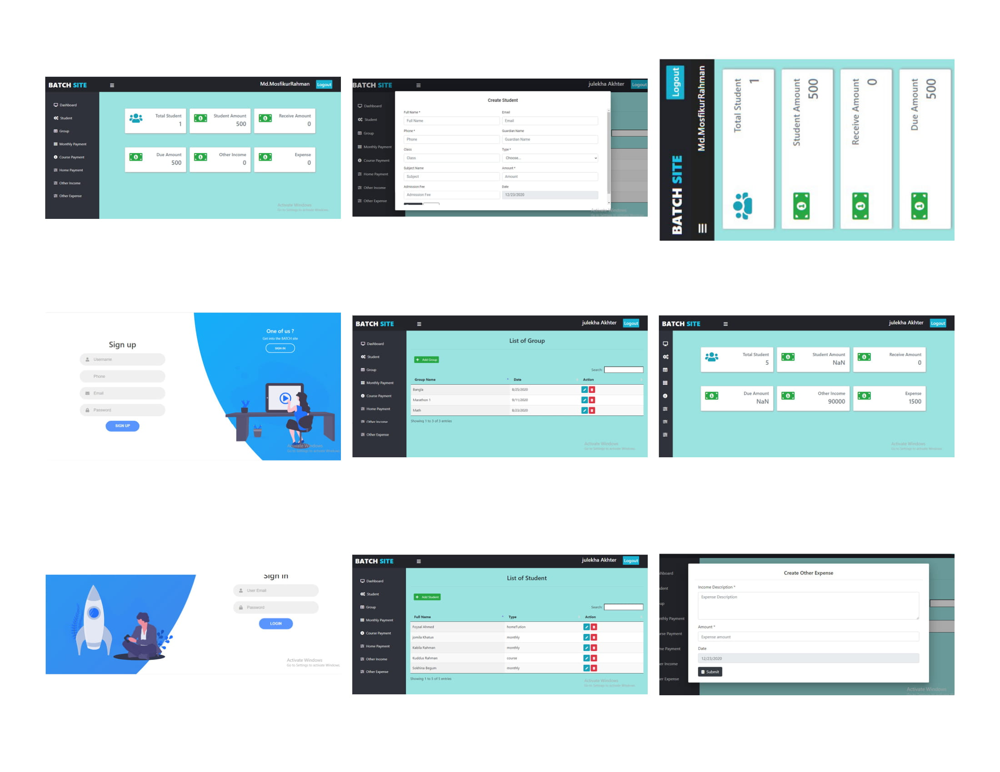

# Project Name
> ## Teacher Management System using Angular and Firebase
# Table of contents
* ### [General info](#general-info)
* ### [Screenshots](#screenshots)
* ### [Technologies](#technologies)
* ### [Setup](#setup)
# General info
**In this project a teacher can manage their student information like Name Class Amount course information student information and many other things. Even if the Student give any payment teacher can manage the payment information in this system so that in future the teacher can track the payment for the student. As well as teacher can manage their income or Expense of any other things and he or she get information about the student payment or other income or expense at the end of a month or a year.**
# Screenshots

# Technologies
* ## Angular7+
* ## Firebase
* ## Typescript
* ## Bootstrap 4
* ## HTML,CSS
# Setup
> ## Download the project, cd into the project directory, run: npm install when necessary node modules are installed, run: npm run serve
